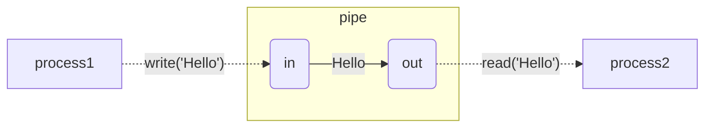
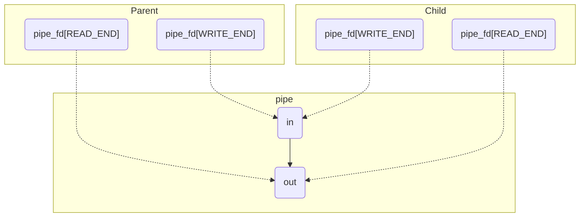
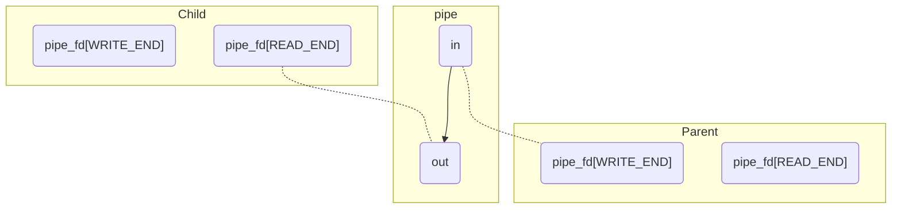
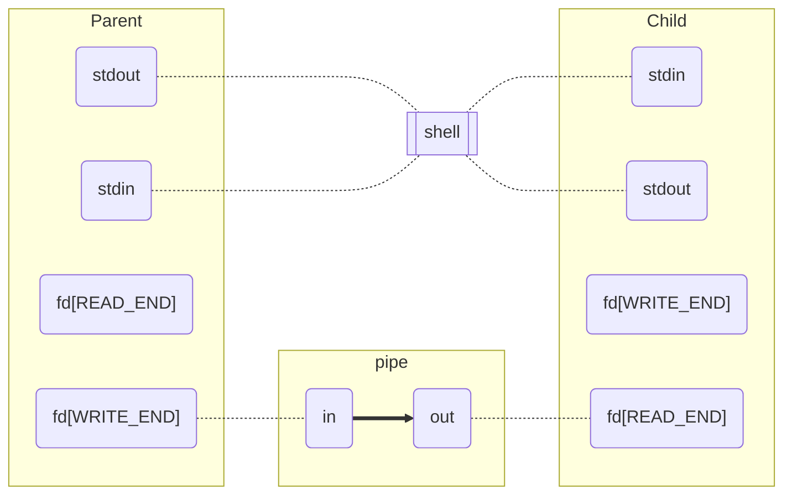
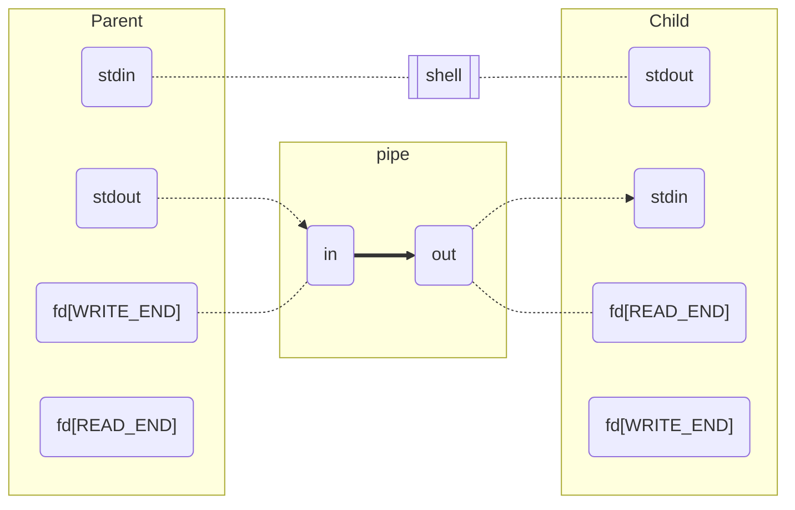
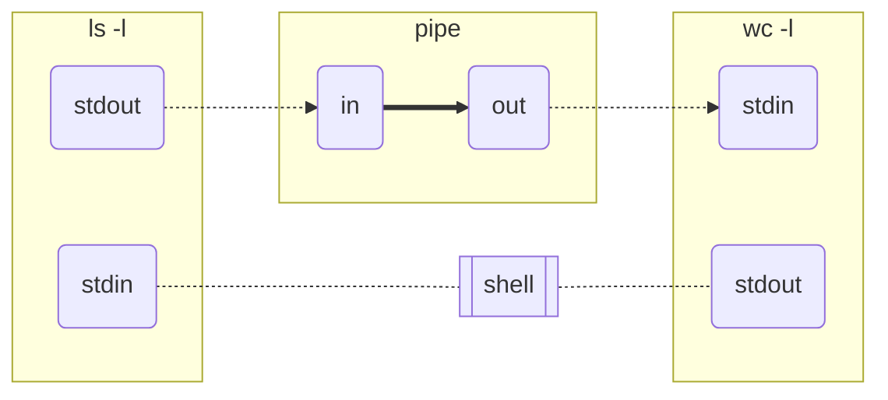
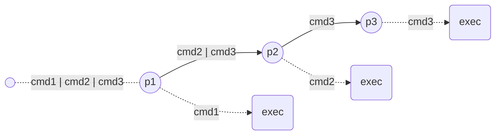
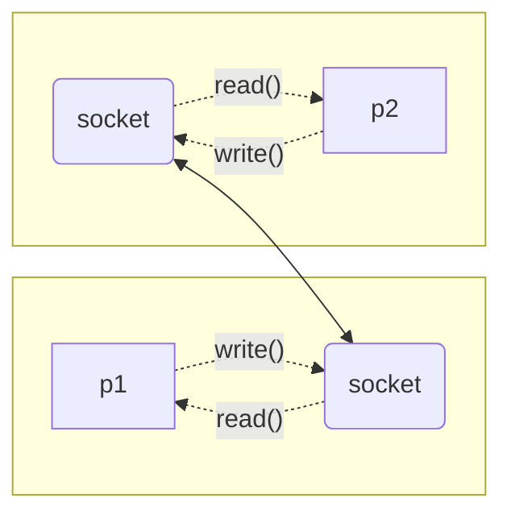
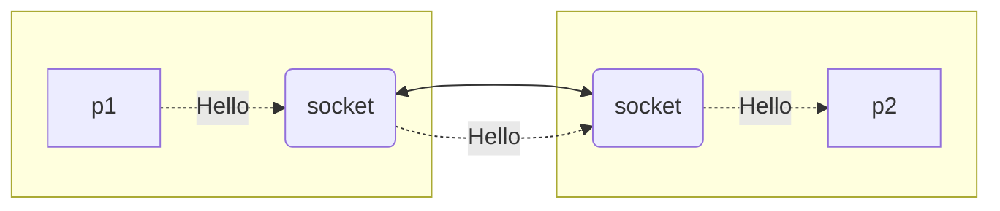
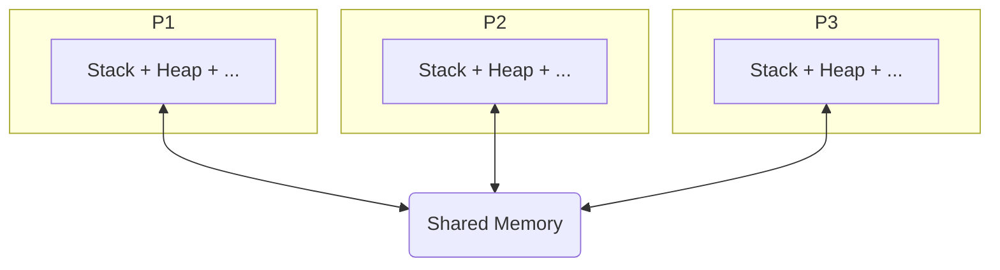

# 1. Pipes overview

- Um **mecanismo unidirecional** de comunicação entre processos (o mais usado)
    - Existe um processo A que escreve p/ o pipe
    - Existe um processo B que lê o pipe
    - Os dados fluem de A para B
    - Comunicação de B para A não seria possível utilizando o mesmo pipe
- **Um pipe tem uma interface de entrada e outra de saída**
    - Entrada, i.e., para escrever no pipe
    - Saída, i.e., para ler o conteúdo do pipe
    - 💡 Em alguns sistemas os pipes podem ser bidirecionais, mas são casos excecionais. No contexto de SO, um pipe é unidirecional
- **Pipes apenas podem ser usados por processos relacionados**, i.e., tem que haver um antecessor comum
    - O exemplo típico é o processo _parent_ criar um _child_ e comunicarem via pipes
- 💡 Pipes são _byte streams_ com uma capacidade máxima
    - Há várias implicações a ter em mente!
    - E.g., se um processo escrever para um pipe cheio, vai bloquear, até que seja libertado espaço
        - Geralmente não nos preocupamos com isto, desde que as aplicações sejam bem programadas
        - Os pipes são desenhados para que haja um processo a ler o pipe assim que haja dados para consumir
        - Logo o cenário de pipe cheio é improvavel ou é meramente temporário
        - A capacidade de cada pipe varia de sistema para sistema, mas são grandes, e.g. 65KB
    - ⚠️ Por serem _byte streams_ não devem assumir que aquilo que escrevem com uma system call `write` vai ser ler lido do pipe tal e qual. Ou seja, vocês podem escrever `"Hello world!"` no pipe. Mas o outro processo ao invocar `read`, pode retornar apenas parte da mensagem, e.g. `"Hell"`. No contexto de comunicação local, isto é improvavel, pois não há overhead de comunicação como existe no contexto de redes. Ainda assim, sinais são um motivo pelo qual operações de `read` e `write` podem ser interrompidas a meio! Notem que o `read` e `write` retornam o número de bytes lidos e escritos. Isto poderá ser uma forma de gerirem comunicações interrompidas. Para o contexto de SO, à partida não têm que se preocupar muito com isto :)

<figure>



<figcaption><b>Figura:</b> Exemplo de utilização de pipes. O pipe tem dois <i>file descriptors</i>. O <code>in</code> é usado para escrever no pipe. O <code>out</code> é usado para ler do pipe. O processo que escreve no pipe deve ser o descritor <code>in</code> na system call <code>write</code>. A mensagem depois fica disponível para ser lida pelo descritor <code>out</code> com a system call <code>read</code>
</figcaption>

</figure>

## 1.1. Exemplo prático

Um pequeno exemplo de utilização de pipes. Versão completa (com verificação de erros) em `demos/pipes.c`. Neste exemplo o processo _parent_ manda duas mensagens para o processo _child_.

```c
/**
 * Example illustrating ICP via pipes
 * In the example, the parent process sends messages to child process (parent writes to pipe, child reads from pipe)
 */

#define READ_END 0
#define WRITE_END 1

/** prepare pipe */
int pipe_fd[2]; // pipe file descriptors
pipe(&fd); // create pipe

/** create process */
int pid = fork();

if (pid > 0) { // parent
    // close the unused pipe end
    close(pipe_fd[READ_END]);
    // send message 1
    char msg1[] = "There are only two kinds of programming languages out there. The ones people complain about and the ones no one uses.\n";
    write(pipe_fd[WRITE_END], msg1, strlen(msg1));
    // send message 2
    char msg2[] = "It's hardware that makes a machine fast. It's software that makes a fast machine slow.\n";
    write(pipe_fd[WRITE_END], msg2, strlen(msg2));
    // close write end, so that child process knows I wont send more messages
    close(pipe_fd[WRITE_END]);
} else if (pid == 0) { // child
    // close the unused pipe end
    close(pipe_fd[WRITE_END]);
    // prepare to read multiple messages in loop, in chunks of 256
    const int buf_size = 256;
    char buf[buf_size];
    int bytes;
    while((bytes = read(pipe_fd[READ_END], buf, buf_size-1)) > 0) {
        buf[bytes] = '\0'; // insert \0 before printing to stdout
        write(STDOUT_FILENO, buf, bytes+1);
    }
    // if 'read' returned 0, then parent closed the pipe write end, and exited loop
    close(pipe_fd[WRITE_END]);
}
```

Explicação do exemplo e resumo do lifecycle tipico na utilização de pipes:
- Processo _parent_ cria o pipe, usando `pipe()` (antes do `fork()`)
    - Obtem dois descritores
        - Os descritores são escritos num array, `pipe_fd` passado como argumento
        - O descritor em `pipe_fd[0]` é para leitura
            - Vejam a macro `READ_END`. É mais fácil usar `pipe_fd[READ_END]` em vez de memorizar as posições!
        - Descritor em `pipe_fd[1]` p/ escrita
- Processo _parent_ faz o `fork()`, criando o processo _child_
    - Como o pipe foi criado antes do `fork()`, o processo _child_ herda esses descritores
- Dependendo da direção de comunicação (_parent_ > _child_, ou _child_ > _parent_), cada processo deverá fechar a interface do pipe que não vai usar
    - No exemplo, _parent_ escreve para o pipe, e _child_ lê do pipe
    - Então, o processo _parent_ deve fechar a sua interface de leitura do pipe, e o _child_ deve fechar a interface de escrita do pipe
    - 💡 Porquê? Explicação mais abaixo!
- Depois são feitas as operações de escrita e leitura, como se de um ficheiro normal se trata-se
    - No exemplo, o _parent_ vai escrever duas mensagens no pipe, uma de cada vez
    - Enquanto que o _filho_ vai ler as mensagens em loop. O meu exemplo é para cenários em que vocês não sabem _a priori_ quantas mensagens serão escritas no pipe. Neste caso, se vocês sabem quantas mensagens e o respetivo tamanho, poderiam ter optado por dois _read_ sucessivos
- Quando um dos processos já não precisar do _pipe_, deverá fechar a interface que esteve a ser usada
    - Pegando no exemplo, em que _parent_ escreve, e o _child_ lê
    - Quando o _parent_ fecha o descritor de escrita, o _child_ será informado disso quando voltar a fazer um `read()`, que irá retornar 0 bytes lidos, indicando EOF (end of file)
    - O mesmo acontece de forma inversa. Se o _child_ fechar o descritor de leitura, o _parent_ saberá disso, pois ao voltar a escrever com o `write()` irá retornar o erro `EPIPE`
        - 💡 Ou será emitido um sinal, `SIGPIPE`. Mas como não falamos de sinais ainda, e o _parent_ não está a capturar sinais, então será retornado o erro `EPIPE`


### 1.1.1. Porque é que se deve fechar o descritor que não é utilizado?

- Comunicação entre pipes só é possível se houver pelo menos um processo a ler e outro a escrever
- O kernel sabe quantos processos têm referência para o `pipe_fd[READ_END]` e `pipe_fd[WRITE_END]`
- Se um processo faz operação de leitura no `pipe_fd[READ_END]`, mas já não existem processos com referências para `pipe_fd[WRITE_END]`, então o retorno de `read` será 0 bytes. Isto indica que não há mais nada a ler, pois é impossível ser escrita alguma coisa no pipe.
- Após a chamada `fork()` e `pipe()`, existem duas referências para o `pipe_fd[READ_END]` e `pipe_fd[WRITE_END]`.
- Supõe o exemplo anterior, e que o processo _child_ não fecha o `pipe_fd[WRITE_END]`
- O _parent_ escreve as duas mensagens e fecha o `pipe_fd[WRITE_END]`
- No entanto, ainda existe uma referência ativa para `pipe_fd[WRITE_END]`, do processo _child_
- Então, o loop que lê mensagens do pipe no processo _child_ irá bloquear à espera que seja escrita alguma coisa no pipe
    - O processo _child_ nunca irá terminar, pois não existe nenhum processo, além do _child_ que possa escrever no pipe
        - O _child_ está bloqueado na operação de `read`, portanto é um estado sem saída
- Em suma, **a primeira coisa que devem fazer em ambos os processos, é fechar a interface do pipe que não irão utilizar!**

<figure>



<figcaption align="center"><b>Figura:</b> Ilustração das referências para a interface de escrita e leitura, após ser feito o <code>fork()</code>, mas caso os processos não fechem o descritor que não usam</code></figcaption>
</figure>

<figure>



<figcaption align="center"><b>Figura:</b> Quando os processos fecham os descritores que não usam, passa a existir apenas uma referência para a interface de escrita e leitura. Assim que o pai fecha o descritor de escrita, o número de referencias é 0, então o processo filho ficará a saber que não há mais nada para ler do pipe.</figcaption>
</figure>

# 2. Q1

Dada o exemplo em cima, acho que será fácil perceber o código deste primeiro exercicio. Em suma:
- O processo pai envia uma mensagem para o filho
    - A mensagem é construída com a função `snprintf`
        - Esta função é semelhante com `printf` ou `sprintf`
        - A string a ser construída pode ter placeholders/formatadores, e.g. `%d`, `%.6f`, etc
        - A diferença do `snprintf` para `sprintf`, é que podem limitar o tamanho máximo da string, que há-de ser o tamanho do vosso buffer
            - E assim evitar erros de memória. Usar `snprintf` será mais seguro!
        - No exemplo, `snprintf` escreve no máximo `LINESIZE` bytes no buffer `line`, incluindo `\0`
- O processo filho lê a mensagem do pipe e imprime no `stdout`

O enunciado depois pede para que o processo pai leia um ficheiro, cujo nome é passado por argumento (hint: `argv[1]`). O conteúdo desse ficheiro é escrito no pipe. Por sua vez, o filho lê o conteúdo do ficheiro do pipe, e imprime na `stdout`.
- A primeira coisa a fazer é definirem a estratégia de leitura do ficheiro no pai
    - Eu recomendo sempre que façam um loop em que vão ler `N` bytes, ou seja, leitura por blocos
    - Por cada bloco que lêm com sucesso do ficheiro, podem escrever diretamente para o pipe

# 3. Q2

Para terminar a implementação do programa, apenas é necessário
- adicionar os `#include` em falta (vejam o `man` para as várias funções utilizadas)
- fazer a gestão dos erros, recorrendo ao `perror()` ou `strerror()` para obter as descrições dos erros
- podem ver as alterações que fiz correndo o seguinte comando:

```shell
$ cd f6/q2 # assumindo que estão na pasta f6/q2 deste repositório
$ diff -y sol.c original.c
```

O que o programa faz é muito simples:
- o _child_ executa o comando `wc -l`
    - Este comando da shell é usado para contar número de linhas, palavras, ... de um ficheiro de texto
        - Se o ficheiro não for especificado por argumento, como é o caso, então irá ler o texto da STDIN
    - A opção `-l` ativa a contagem de linhas, que serão imprimidas no STDOUT
- o _parent_ executa o comando `ls -l`
- o programa é configurado para que o STDOUT do comando `ls -l` seja ligado ao STDIN do `wc -l`
    - ou seja, o programa no geral irá imprimir o número de linhas no output do comando `ls -l`
    - seria equivalente a executar os comandos usando pipes na shell, i.e., `ls -l | wc -l`

Para se conseguir este efeito é necessário:
1. criar um pipe
2. fazer `fork()`
    - mais tarde o _parent_ irá executar o comando `ls -l`, e o _child_ o comando `wc -l`
3. cada processo fecha a interface do pipe que não irá utilizar

<figure>



<figcaption align="center"><b>Figura: </b>Estado dos descritores após <code>fork()</code> e cada processo fechar a interface do pipe que não irá utilizar</figcaption>
</figure>

4. ajustar os descritores do `stdout` e `stdin` para apontarem para o pipe
    - por default, o `ls` irá escrever para o STDOUT, e o `wc` ler da STDIN
    - o `ls` e `wc` são programas, e não podemos alterar o seu código para que usassem diretamente o pipe criado acima
    - o truque consiste em:
        - associar o descritor com id `STDOUT_FILENO` do _parent_ ao `WRITE_END` do pipe
        - associar o descritor `STDIN_FILENO` do _child_ ao `READ_END` do pipe
    - desta forma, quando o _parent_ escreve para a `STDOUT`, estará na verdade a escrever para o pipe
    - quando o _child_ ler da `stdin`, está na verdade a ler do pipe
    - para se meter um descritor a referenciar outro, mantendo o seu identificador, usa-se a função `dup2`
        - o _parent_ executa `dup2(fd[WRITE_END], STDOUT_FILENO);` e faz com que o `STDOUT_FILENO` aponte para o `WRITE_END` do pipe
        - o `dup2` também irá fazer close do `STDOUT_FILENO`, 

<figure>



<figcaption align="center"><b>Figura: </b>Estado dos descritores após <code>dup2</code>. Se o processo pai escrever para o stdout, estará efetivamente a escrever para o pipe. Se o processo filho ler do stdin, estará a ler do pipe.</figcaption>
</figure>

5. ⚠️ Pelos motivos descritos na secção 1.1.1, devem fechar os _file descriptors_ originais do pipe após o `dup2`, i.e., `fd[WRITE_END]` e `fd[READ_END]`. Reparem na figura anterior. Após o `dup2`, existem dois file descriptors para a entrada e saída do pipe. O comando que vocês irão lançar com o `exec`, apenas irá usar o `stdout` e `stdin`. Não irá usar os descritores criados para o pipe, embora os herde.

```c
/* parent */

// close unused pipe read end
close(fd[READ_END]);
// stdout to pipe
dup2(fd[WRITE_END], STDOUT_FILENO);
// NOTE: close the pipe write end, wont be used by the launched process with exec
close(fd[WRITE_END]);
```

6. após ajustar os descritores, basta fazer o `exec`
    - notem que quando fazem `fork()` ou `exec()`, os _file descriptors_ abertos são "herdados"
    - portanto quando o _parent_ faz `execvp("ls", cmd1)`, lançado assim o `ls -l`, e o comando escreve para o seu `STDOUT`, na verdade está a escrever para o `WRITE_END` do pipe

<figure>



<figcaption align="center"><b>Figura: </b>Quando os comandos <code>ls</code> e <code>wc</code> executarem, estarão a utilizar o pipe previamente criado.</figcaption>
</figure>


# 4. Q3

A solução para este problema consiste em generalizar o código de Q2, para criar `N-1` pipes para executar `N` comandos.

Supõe o comando `cat file.c | grep fprintf | wc -l`, que conta o número de vezes que a função fprintf é invocada no programa `file.c`.
- O `cat` abre o ficheiro e escreve na stdout, que é redirecionado para o 1º pipe
- O `grep` procura matches da string `fprintf`
    - Por default, lê da `stdin`, que neste caso vem do 1º pipe.
    - Os resultados são escritos na `stdout`, neste caso redirecionado para o 2º pipe
- O comando `wc -l` conta o número de linhas num bloco de texto
    - Lê da `stdin`, que vem do 2º pipe
    - Escreve na `stdout` (não há mais pipes nem qualquer redirecionamento, logo vai aparecer na shell)

Uma possível abordagem para o problema, é usar recursividade. A cada passo recursivo, extraimos o primeiro comando da cadeia de pipes. O processo pai (P) pode ser responsável por executar esse comando. O processo filho (F) é responsável por processar o resto da cadeia. E claro, antes de ser feito qualquer `exec`, será necessário conectar as `stdout` e `stdin` ao pipe. Neste esquema, seria preciso:
- Ligar o `stdout` do processo P à entrada do pipe
- Ligar a saída do pipe à `stdin` do processo F

```
Seja CMD = "cat file.c | grep fprintf | wc -l"

Extrair o primeiro comando na cadeia de pipes, e o resto do comando
Seja CMD_ATUAL = "cat file.c"
Seja CMD_RESTO = "grep fprintf | wc -l"

Criar o pipe
Fazer o fork
    O processo pai:
        Ligar stdout à entrada do pipe
        Executar o comando atual, CMD_ATUAL, com exec
    O processo filho:
        Ligar saída do pipe à stdin
        Recursivamente processar o resto do comando, CMD_RESTO
            Nota: Este processo filho, no próximo passo recursivo, desempenha o papel de Pai
```

A cada passo recursivo, temos o pai a executar `CMD_ATUAL`, cuja `stdout` é ligada à entrada do pipe. E o filho, que irá processar o resto da cadeia de pipes, tem a sua `stdin` conectada à saída do pipe. Portanto, a cada passo recursivo, resolvemos uma das pipes do comando inicial `CMD`, criando: `CMD_ATUAL | CMD_RESTO`.

A condição de paragem é quando o `CMD` já não tem mais pipes, ou seja, `CMD_RESTO = NULL`. Quando se atinge esta condição, já não é necessário criar mais pipes nem fazer fork. O processo que encontra essa condição é responsável por executar o último comando da cadeia original de pipes.

<figure>


<figcaption align="center">
    <b>Figura: </b> Demonstração do processamento de um comando inicial com uma cadeia de pipes
</figcaption>
</figure>

Instruções para compilar e executar:
```shell
$ cd f6/ # pasta f6 deste repositório
$ make q3
$ ./bin/q3 "cat q3/sol.c | grep fprintf | wc -l"
6
```

# 5. Q4 && Sockets

## 5.1. Sockets overview

- Sockets permitem estabelecer uma interface de comunicação entre duas entidades (e.g., processo - processo, cliente - servidor, ...)
- A comunicação via sockets é bidirecional
    - Vantagem sobre os Pipes, que são unidirecionais
- Quando se fala em sockets, tipicamente pensa-se num contexto de redes/internet, i.e., sockets que permitem dois computadores distintos comunicarem pela rede
    - Terão oportunidade de aprender sobre esses sockets na cadeira de redes e sistemas distribuídos
    - Estabelecer a comunicação entre um par de sockets requer vários passos
        1. Cada processo ou sistema cria o seu socket
        2. Estabelecer conexão entre os dois sockets (no contexto de redes, um socket será identificado, e.g., por um IP e uma porta)
        3. Escrita e receção de mensagens
        4. Terminar a conexão
- No contexto de SO, vamos focar em **sockets locais** (sockets UNIX), que podem ser usados para comunicação entre processos a executar no mesmo sistema
<figure>



<figcaption align="center"><b>Figura:</b> Ilustração da utilização de sockets para comunicação entre dois processos, <code>p1</code> e <code>p2</code>. Cada processo usa o seu socket. O par de sockets tem conexão estabelecida, que permite comunicação bidirecional.</figcaption>
</figure>

Na figura acima, temos a ilustração de dois processos, P1 e P2, cada um com o seu socket. Estes sockets têm comunicação estabelecida. Se P1 quiser enviar uma mensagem para P2:
1. Escreve a mensagem no seu socket.
2. Os sockets estão conectados, logo a mensagem será transmitida para o socket de P2
3. P2 terá que ler o conteúdo do socket

<figure>



<figcaption align="center"><b>Figura:</b> Exemplo em que o processo <code>p1</code> envia uma mensagem para <code>p2</code></figcaption>
</figure>

Para criar um par de sockets já conectados, para comunicação entre processos, é mais simples utilizar a função `socketpair`.
- 1º argumento deve ser `AF_UNIX`, e especifica uma familia de protocolos
- 2º argumento costuma ser `SOCK_STREAM`, para termos o mesmo mecanismo de transferência de dados que um pipe.
- 3º argumento está relacionado com os dois primeiros (familia de protocolos e tipo de comunicação). Usa-se `0` para ser usado um protocolo por defeito
- 4º argumento deve ser passado um array `int [2]`, onde serão escritos os descritores dos dois sockets
    - Cada socket é exposto a cada processo por um _file descriptor_. Este pode ser usado para operações de escrita e leitura
        - Nos pipes tinhamos dois descritores, um para escrita, outro para leitura
        - Com sockets, um só descritor é usado para ambas as operações
    - Que socket pertence a qual processo? Isso fica ao vosso critério. O `socketpair` será invocado antes do `fork`, pelo que os dois sockets ficam disponíveis para ambos processos. Devem decidir se o descritor no indice `0` deve ser usado pelo pai ou pelo filho. E o descritor no indice `1` será então usado pelo outro processo. Como os sockets são bidirecionais, tanto faz!

💡 Seria possível usarem as funções `socket()` (provavelmente irão encontrar no StackOverflow, etc.) mas seria preciso manualmente estabelecer a conexão, portanto dá mais trabalho... Para o contexto de SO, basta explorarem a API `socketpair`.

## 5.2. Exemplo do enunciado

Breve descrição do exemplo:
- Foi definido que o socket cujo descritor está em `sockets[0]` corresponde ao processo pai. Logo o processo filho faz `close(sockets[CHANNEL0])`. E vice-versa, o pai faz `close(sockets[CHANNEL1])`.
    - Pessoalmente daria outros nomes às macros. Por exemplo, `#define CHANNEL_PARENT 0`, e `#define CHANNEL_CHILD 1`. Assim fica mais óbvio que o socket com descritor armazenado em `sockets[CHANNEL_PARENT]` é suposto ser usado pelo pai. E o pai para fechar o socket usado pelo processo filho faria `close(fd[CHANNEL_CHILD])`.
        - Pessoalmente até prefiro chamar `SOCKET_PARENT`, porque cada descritor refere-se a um _socket_. O canal é o estabelecimento de conexão entre sockets que permite a transmissão de dados. Uma questão de gosto :)
    - Porque é que temos que fechar o `socket` que não será usado, i.e., o pai fechar o socket que vai ser usado pelo filho? A lógica é a mesma que para os pipes. Enquanto houverem referências para os sockets, a conexão não é destruída. Se estiverem a ler de um socket em loop, o `read` só retorna `0` quando a conexão for destruída
- No passo seguinte o processo pai envia a mensagem `"In every walk with nature..."`.
    - Como explicado acima, para o pai mandar uma mensagem ao filho, basta escrever essa mensagem no seu socket. O socket do pai e socket do filho têm conexão estabelecida, e portanto a mensagem é transmitida do socket do pai para o socket do filho sem qualquer passo adicional.
- O processo filho lê a mensagem do seu socket, e imprime na `stdout`
- O processo filho escreve a mensagem `"...one receives far more than he seeks."`
- O processo pai lê a mensagem do seu socket e imprime na `stdout`


Notem que se executarem várias vezes, poderão ver o output das mensagens em ordens diferentes. Embora as operações de `read` e `write` sejam _blocking_ por defeito, dependendo do escalonamento de processos do sistema operativo é normal que os prints ocorram em instantes diferentes.
- _blocking_ significa que quando fazem `read` a um socket, a função apenas retorna quando houver alguma coisa para ler

Exemplo 1:
```
message from 168082-->In every walk with nature...
message from 168083-->...one receives far more than he seeks.
```

Exemplo 2:
```
message from 168083-->...one receives far more than he seeks.
message from 168082-->In every walk with nature...
```

O primeiro caso pode acontecer, por exemplo, nesta sequência:
- Pai: fecha o socket que não vai usar, `close()`
- Pai: escreve mensagem no socket, `write(...,"In every walk with nature...",...)`
- Pai: lê mensagem do socket, `read()`. Ainda não há mensagem, bloqueia
- Filho: fecha o socket que não vai usar, `close()`
- Pai: `read()` continua bloqueado, não há mensagem para ler
- Filho: lê mensagem do socket, `read()`
- Filho: escreve mensagem no socket, `write(..., "...one receives far more than he seeks.", ...)`
- Filho: imprime a mensagem que recebeu no socket, `printf()`: `"message from 168056-->In every walk with nature..."`
- Filho: termina
- Pai: `read()` retorna, pois chegou uma mensagem ao socket.
- Pai: imprime a mensagem, `printf()`: `"message from 168057-->...one receives far more than he seeks."`
- Pai: espera que o filho termine, `waitpid`, que irá retornar de imediato pois o filho já terminou
- Pai: termina

O segundo caso pode acontecer, se:
- Pai: fecha o socket que não vai usar, `close()`
- Pai: escreve mensagem no socket, `write(...,"In every walk with nature...",...)`
- Pai: lê mensagem do socket, `read()`. Ainda não há mensagem, bloqueia
- Filho: fecha o socket que não vai usar, `close()`
- Filho: lê mensagem do socket, `read()`
- Filho: escreve mensagem no socket, `write(..., "...one receives far more than he seeks.", ...)`
- Pai: `read()` retorna, pois chegou uma mensagem ao socket.
- Pai: imprime a mensagem, `printf()`: `"message from 168057-->...one receives far more than he seeks."`
- Pai: espera que o filho termine, `waitpid`, bloqueia
- Filho: imprime a mensagem que recebeu no socket, `printf()`: `"message from 168056-->In every walk with nature..."`
- Filho: termina
- Pai: termina

Nota: após o fork, o filho poderia ser o primeiro processo a executar, mas irá bloquear no `read` pois o pai ainda não transmitiu nenhuma mensagem

## 5.3. Soluções

O exercicio é basicamente copy-paste do primeiro, mas desta vez com sockets. Podem ver a minha resolução em `q4/sol.c`.

```shell
$ cd f6/
$ make q4
$ ./bin/q4 q4/sol.c
```

# 6. Q5 (Shared Memory)

O que o programa faz:
1. Lê de um ficheiro uma matriz de números, que serão guardadas em `int matrix[n][n];`
2. Cria um array `partials` que fica em memória partilhada. Este array é utilizado pelos vários processos filhos para que cada um guarde a sua contagem. Cada processo filho, `P_i`, escreve na posição `i` deste array. Desta forma, não existem problemas de race conditions!
3. Cada processo filho, `P_i`, vai percorrer a linha `i` da matriz e contabilizar todos os valores que são maiores que `threshold`. Essa contagem fica em `partials[i]`
4. Processo pai aguarda que os filhos terminem, fazendo tantos `waitpid(-1, NULL, 0)` quanto o número de filhos lançado
5. Quando todos os filhos terminarem, soma todos os valores em `partials`. A variável `total` terá o resultado final, i.e., quantos valores são superiores a `threshold`
6. Por fim, o processo pai liberta o espaço de memória partilhada

O programa do exemplo do enunciado espera 3 argumentos:
- Nome do ficheiro com o tamanho e números que compõe a matriz
- Número de processos a lançar
- Um threshold `T`, tal que apenas os números superiores a `T` sejam contabilizados

```bash
#ensure you are in the f6 folder
$ cd f6/
#example matrix input file
$ cat q5/matrix.txt
5 #size of the matrix is 5x5
49 -5 12 44 8
10 21 38 30 15
11 27 31 5 37
25 3 47 -7 24
43 -12 35 -18 -2
# compile
$ make q5/original
# execute with the 3 arguments. launch 5 processes. count numbers above 40
$ ./bin/q5-original q5/matrix.txt 5 40
4
```

## 6.1. Memória partilhada & `mmap`

- Neste exemplo foi usada memória partilhada, mais mecanismo IPC que temos disponível.
- Memória partilhada é uma região de memória que é partilhada por vários processos. Estes podem ler e escrever diretamente nesse espaço de memória.
    - **Para operações de escrita existe o risco de _race conditions_**, se diferentes processos escreverem nas mesmas posições 
    - No exemplo, embora o array `partials` seja partilhado, cada processo escreve num índice distinto e portanto não há esse risco
- Relembra que após um `fork`, todo o espaço de memória do processo pai é copiado para o filho, passando a existir dois espaços de memória completamente distintos. O que o filho escreve na memória não se reflete no pai e vice-versa
- Um segmento de memória partilhado é único e é partilhado pelos vários processos que o acedem



Para criar memória partilhada pode-se usar o `mmap`. **Esta system call pode parecer bastante confusa porque também serve outro propósito** que irei falar depois.
- Existem outras APIs, como `shm_open`

Protótipo: `void *mmap(void *addr, size_t length, int prot, int flags, int fd, off_t offset);`
- `addr`: permite **sugerir** ao kernel onde é que a região de memória será alocada. Geralmente passa-se `NULL` e deixa-se o kernel decidir. **O endereço onde a região é alocada é o valor de retorno**.
- `length`: quantidade de bytes a serem alocados
- `prot`: define a proteção do segmento de memória. No exemplo é usado `PROT_READ | PROT_WRITE` possibilitando leituras e escritas na região de memória
- `flags`: permite configurar se alterações no segmento de memória devem ser visiveis para outros processos (estranho, right? mas tem haver com o outro _use case_ que mencionei). `MAP_SHARED` faz com que alterações sejam visíveis em todos os processos. `MAP_ANONYMOUS` significa que a memória partilhada não é suportada por nenhum ficheiro, e por isso será inicializada a 0.
- `fd`: no seguimento do `MAP_ANONYMOUS`, este descritor deve ser 0 ou -1
- `offset`: seria um offset se usassemos um ficheiro, mas como usamos `MAP_ANONYMOUS`, fica a zero.

Para recapitular, **para criarmos uma região de memória partilhada por vários processos de `N` bytes**, devem usar a system call desta forma: `mmap(NULL, N, PROT_READ | PROT_WRITE, MAP_SHARED | MAP_ANONYMOUS, 0, 0);`

O `mmap` retorna um endereço de memória que corresponde a um bloco contiguo de `N` bytes. Como é que usam? Da mesma forma que usariam um `malloc(N)` 😄 A diferença é que a memória alocada por `mmap` é partilhada por vários processos, enquanto que o `malloc` é privado, faz parte do espaço de memória de um dado processo e nenhum outro processo pode aceder/modificar.

## 6.2. Memory-Mapped file I/O

- O outro _use case_ do `mmap` é mapear ficheiros no file system para memória. Ou seja, em vez de se ler/escrever um ficheiro do disco com `read` e `write`, é possível usar o `mmap`.
- É um dos motivos porque a chamada `mmap` aceita um descritor de ficheiro, permissões, offsets, etc.

Motivação para mapear ficheiros para memória?
- Geralmente performance, em particular quando se lida com ficheiros muitos grandes e padrões aleatórios de leitura!
- Quando se mapeia um ficheiro para memória com o `mmap`, não é feita uma leitura do ficheiro para memória. Em vez disso, o kernel usa _lazy loading_, i.e., apenas irá carregar a informação do disco para memória quando o programa acede a certas regiões
- Escritas no memória mapeada também não são logo escritas para disco
- Também há a vantagem do ficheiro mapeado ser acessivel por vários processos, permitindo que se poupe memória, já que não teremos vários processos a criar buffers para guardar o conteúdo do ficheiro

Mais vantages e desvantagens de mapear ficheiros para memória:
- https://stackoverflow.com/a/46442219
- https://stackoverflow.com/a/258097

# 7. Q6 (sinais)

```shell
$ cd f6
$ make q6/original
$ ./bin/q6-original
My PID is 309387
```

Noutra shell usem o comando `kill` para enviar sinais para o processo:
```shell
$ kill -USR1 309387
$ kill -USR2 309387
$ kill -HUP 309387
```

💡 Para especificar o sinal, tanto podem usar `SIGUSR1`, como omitir o prefixo `SIG` e escrever apenas `USR1`

Na primeira shell, ondem têm o programa a correr em loop infinito, irão ver as mensagens:
```shell
received SIGUSR1
received SIGUSR2
received SIGHUP
```
