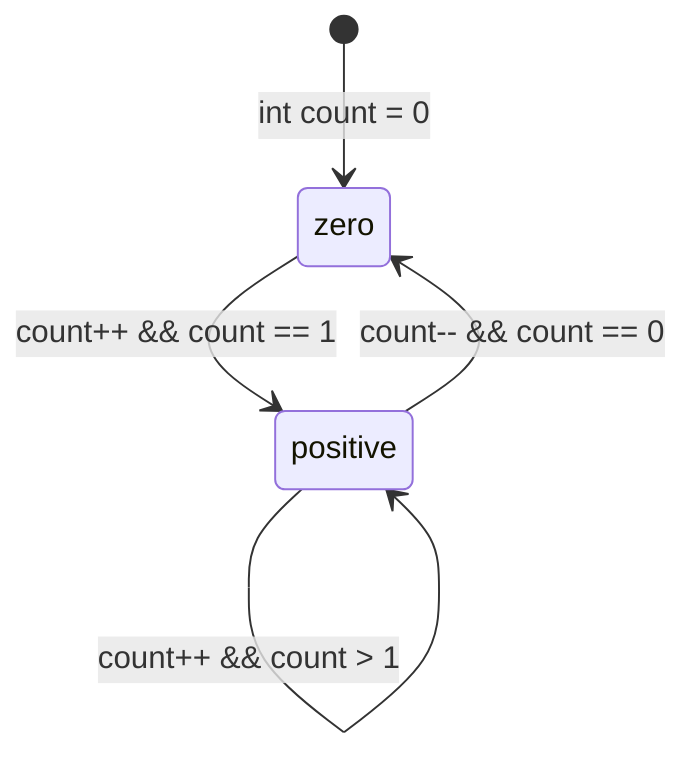

# Q1 && Threads overview

- Compiling programs that use `pthread` library
    - Do not forget to link with `-pthread`
    - `$ gcc -pthread my_program.c`
    - `$ clang -pthreads my_program.c`
- Threads are created with the function `pthread_create` with the following arguments:
    - Example: `pthread_create(&tid, NULL, fn, NULL)`
    1. The thread identifier is passed by argument, i.e., it is written in the variable `tid` defined in the calling parent thread
    2. Second argument configures the thread (attributes). Can be used to make the thread detachable, set a stack size, etc. I dont think is relevant for this particular course, so pass `NULL` :)
    3. The starting routine. Threads execute a sequence of instructions that must be defined in a function. That function has a single parameter `void *` and returns `void *`. We will see in a moment how to pass one or more arguments and get the return value.
    4. Used to pass an argument, if any.
- Threads execute asynchronously. I.e., the main/parent thread along any launched thread will execute concurrently (or even in parallel on multi-core CPUs), and in any order.
    - This is a problem if threads share resources, such as memory, and that is why we need synchronization mechanisms
    - E.g., multiple threads writing to the same variable
- Usually the main/parent thread will wait for threads to terminate. If the parent process ends, every launched thread terminates. In order to do that, we can use `pthread_join`. It can also be used to get the thread's return value. The arguments are:
    1. The thread identifier
    2. A pointer to a memory location where the threads result is written
- Note: if threads call `exit` the process is terminated. Threads can either `return` or call `pthread_exit` to terminate.

## The Q1 example

- There is a global variable `count`
- In main function, two threads are launched with `pthread_create`
    - The threads do not receive any argument (last argument)
    - Threads will execute the function `inc`
    - The thread identifiers are stored in variables `tid1` and `tid2`
- The main thread does not do any further computation, so it has to wait for the threads to terminate
    - If the main thread did `return` or `exit`, both threads `tid1` and `tid2` would terminate immediately
    - Hence, it calls `pthread_join` on both threads
- Looking at the function `inc`
    - Each thread performs a loop with 10^6 iterations and increment the global variable `count`

### The problem

If you run the program multiple times, you will get varying outputs. The problem is that we have **two threads writing to the same variable without any synchronisation**.

Altough `count++` looks like an atomic operation, it is not. But even if it was, imagine that both threads are perfectly running in parallel, on different CPU cores. At some time instant, `count` is 500, and both threads execute `count++`. What is the final result? 501, when it should be 502.

Nonetheless, `count++` is not an atomic operation. If you think at the assembly and architectural level, there are at least three operations:
1. `load`, load from memory into a register
2. `add`, increment the value stored in the register
3. `store`, write the register value back in memory

As threads run concurrently, the following can happen (ascending time):
- T1 (thread 1) loads the variable value from memory into a private register. Let say the value is `500`. `R1 <- 500`
- T1 is stopped by the operating system (OS)
- T2 is scheduled by the OS
- T2 executes the load, `R2 <- 500`
- T2 increments, `R2 <- R2 + 1`
- T2 stores the result in memory, so the memory position of `counter` holds `501`.
- Later T1 resumes. It increments: `R1 <- R1 + 1`. The value of `R1` was `500`, so now it holds `501`
- T1 stores the result in memory. The memory position of `counter` holds `501`.

So, the value of `counter` should be `502`, but it is `501`. Things will be messier in practice, because it is likely that threads will perform multiple iterations. So suppose that in the previous example `T2` managed to do 20 iterations and `counter` is `520`. T1 would then resume from the value `500`, so `20` increments are simply lost!

So, how to solve this? We need mutexes! That is part of Q2!

## Threads: passing arguments

So, this is where things can become a bit tricky. The API for launching a thread is quite generic. It takes a single argument, `void *`, and returns a single value, `void *`.

**Passing a single argument** is quite straightforward, but there are a few things to consider! You need to keep in mind that you are passing an address to the thread, and that address needs to be valid when the thread executes. Perhaps it might help to analyse your program and think: between `pthread_create` and `pthread_join`, i.e., the thread lifespan, is this variable or memory block defined? If it is, no matter what time the thread executes, your program will be correct. If there is a minimum chance of the memory being undefined... then you need to find an alternative.

```c
void *foo(void *arg) {
    int n = *((int*) arg);    
    printf("Thread: I got %d\n", n);
    return NULL;
}

int main() {
    int num = 10;
    pthread_t tid1;
    pthread_create(&tid1, NULL, foo, (void*) &num);
    pthread_join(tid1, NULL);
}
```

- Variable `num` in `main` is valid throughout the thread lifespan, so I can pass its address as an argument to the thread
- The thread, in `foo`, casts the `void* arg` to `int *` --- `(int*) arg`. Then dereferences the address to store the value in the local variable `num`
    - `*(int*) arg` is also valid, as the casting has priority over the dereference operator

**What if you need multiple arguments**? The common approach is to use structs to pack all the variables you need.

```c
void *add(void *arg) {
    operands_t *op = (operands_t*) arg;
    pthread_t me = pthread_self();
    
    printf("Thread %ld: %d + %d = %d\n", me, op->a, op->b, op->a + op->b);
    
    return NULL;
}

int main() {
    operands_t op1 = {4, 6};
    operands_t op2 = {0, 3};
    pthread_t tid1, tid2;
    pthread_create(&tid1, NULL, add, (void *)&op1);
    pthread_create(&tid2, NULL, add, (void *)&op2);
    pthread_join(tid1, NULL);
    pthread_join(tid2, NULL);
}

// Output
// Thread 140380333512256: 4 + 6 = 10
// Thread 140380325119552: 0 + 3 = 3
```

### Hackish solution for single parameters

**You may see some tricks in the internet for passing single arguments**, particularly scalar integer types.

```c
void *foo(void *arg) {  
    printf("Thread: I got %d\n", (int)arg);
    return NULL;
}

int main() {
    pthread_t tid1;
    pthread_create(&tid1, NULL, foo, (void*)10);
    pthread_join(tid1, NULL);
}
```

So the thread routine takes a single argument that should be `void *`, i.e., an address for something! Rather than passing a valid address, we pass an integer value that we casted to `void *`. Pointers are usually 32-bit or 64-bit variables, depending on your processor. As long as the casted number fits in a pointer variable size, then... it works! The thread routine just needs to cast `arg` before using it.

**This prone to bugs if you don't know what you are doing :) So you should avoid it!**.

But there are cases where it becomes handy. Suppose you have a `for` loop and you need to pass the variable `i` value to each thread. You cannot simply pass the address of `i` because at each iteration its value changes. When threads effectively run and access the variable value it might be a wrong value! So passing the value of `i` instead of its address is a simple and quick workaround.

```c
for (int i = 0; i < N; i++)
    pthread_create(NULL, NULL, demo, (void*)i);
```

For instance, suppose a long integer represented with 64-bits in a 32-bit CPU architecture. Basically the argument would be truncated and yup.. things could go wrong!

# Q2

In Q1 we concluded the code has a race condition when accessing the global variable `count`. When the threads increment it, they should access it and modify it inside a **critical section**.

When a thread enters a critical section, no other thread can be it. In this example, the critical section is just the statement `count++`.

```c
void * inc(void * arg)
{
    pthread_mutex_lock(&lock);
        for (int i=0; i<1000000; i++)
            count++;
    pthread_mutex_unlock(&lock);
    return NULL;
}
```

In the example, the **mutexes surround the entire loop, meaning the entire loop is the critical section**. This is not very efficient, because there is not parallelism at all. Suppose the first thread, T1, gains control over the mutex. Then T2 can only execute anything when T1 completes the loop and releases the mutex. Effectively, threads execute the loop in order.

Can we do better?

## Improving: 1st attempt (naive)

As mentioned before, the critical section is just the statement `count++`. So, why not moving the mutex lock/unlock inside the loop?

```c
for (int i = 0; i < 1000000; i++) {
    pthread_mutex_lock(&lock);
    count++;
    pthread_mutex_unlock(&lock);
}
```

This is a valid solution! However, **if we measure the execution time and compare against the previous approach is actually.. slower**?! As demonstrated below, the original version runs in 0.008s, and this naive approach in 0.150s (~19x slower).

```shell
$ cd f7

$ make q2-original
$ time ./bin/q2-original
Start: 0
End: 2000000
./bin/q2-original  0,01s user 0,00s system 97% cpu 0,020 total

$ make q2/naive
$ time ./bin/q2-naive
Start: 0
End: 2000000
./bin/q2-naive  0,21s user 0,08s system 193% cpu 0,150 total
```

The problem is that the mutex access is executed 10^6 times per thread and induces a lot of overhead. Besides, there is not much parallel work to justify the synchronisation overhead. If you think at assembly level, the only instructions the threads can execute independetly is the loop control flow, i.e.,:
- Increment the variable `i`
- Evaluate exit condition, `i < N`
- If condition met, execute `pthread_mutex_lock` and probably block...

If there was a significant amount of work that could be done in parallel, then the critical section on every loop iteration would not be that bad. Nonetheless, is not ideal...

## 2nd attempt (reduction)

A better approach is to use a reduction pattern. Basically, rather than continously update the global variable that contains the final result, what if the threads compute a sub-result in parallel and then we join add the sub-results to compute the final result?

In other words, each thread would compute the 10^6 iterations and store the its local result in a local variable `my_count`. When the thread completes, it accesses the global variable to add its sub result, `count += my_count`. **Of course, this operation would be done in a critical section**.

Once all threads complete, `count` is the correct result.

```c
void *inc(void *arg) {
    int my_count = 0;
    
    for (int i = 0; i < 1000000; i++)
        my_count++;
    
    pthread_mutex_lock(&lock);
    count += my_count;
    pthread_mutex_unlock(&lock);
    return NULL;
}
```

With this approach, parallelism degree is much higher, as the loop is computed in parallel without synchronisation. There is just one synchronisation barrier in the end, so it is much better!

```shell
$ make q2/reduction
$ time ./bin/q2-reduction
Start: 0
End: 2000000
./bin/q2-reduction  0,01s user 0,00s system 148% cpu 0,005 total
```

## Dec and Inc

The exercise also asks to modify the program such that one thread increments and the other decrements the counter. In case the counter is negative, print a message.

The solution is on `q2/inc_dec.c`:
- Copy the original `inc` function, rename to `dec`
- Replace `counter++` with `counter--`
- Add conditional `printf` when `counter < 0`
- In `main`, set one of the `pthread_create` to invoke `dec` instead of `inc`

# Q3

The example shows a possible solution to prevent the counter from going below zero using **conditional variables**.

## Without conditional variables

Before looking into that, how can we modify the `q2/inc_dec.c` program to accomplish the same thing? Well, in `dec` function, just add a condition before decrementing, like `if (count > 0) counter--;`. Solution in `q3/mutex.c`.

The problem with this solution is the thread running `dec` may consume CPU time without any need. Let's say that `counter` is `0` and the thread running `inc` is stalled for a long time. The OS will keep scheduling the `dec` thread, but it won't do anything useful:
1. gains control of the mutex
2. `count > 0` is not true
3. releases the mutex
4. and repeat.

Unless the `inc` thread runs and increments `counter` at least once, running the `dec` thread is a waste of CPU.

## Using conditional variables

**Conditional variables** to the rescue! These are **very useful when you want to enter a critical section only if some condition is met**.

Our goal is to decrement `count` if it is positive, which is a state that is only possible after `count` is incremented once. In the example:
- in `dec` function, you will find a new loop in the critical section. It checks if `count == 0`, and if so it invokes `pthread_cond_wait`. The effect is that the thread will block until is signaled. **Note that the mutex is also released, allowing the other thread to continue executing! When it returns, after being signaled, it will acquire the mutex again!**
- In `inc`, the thread calls `pthread_cond_signal` everytime it increments `count`, notifying the other thread.

## Reducing number of signals

We can reduce the number of singals if we consider the following state machine:



The thread running `dec` can only decrement `count` if the current state is positive, i.e., `count > 0`. In case the state is zero, it is enough to signal the transition to positive state that happens when `count == 1` after an increment.

Updating the `inc` function as shown below is enough to reduce the signals:

```c
pthread_mutex_lock(&lock);
count++;
if (count == 1)
    pthread_cond_signal(&not_zero);
pthread_mutex_unlock(&lock);
```

Complete code in `q3/enhanced.c`.